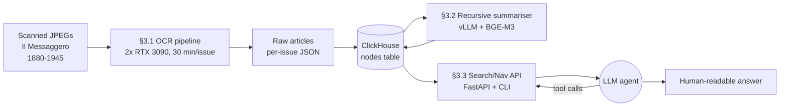
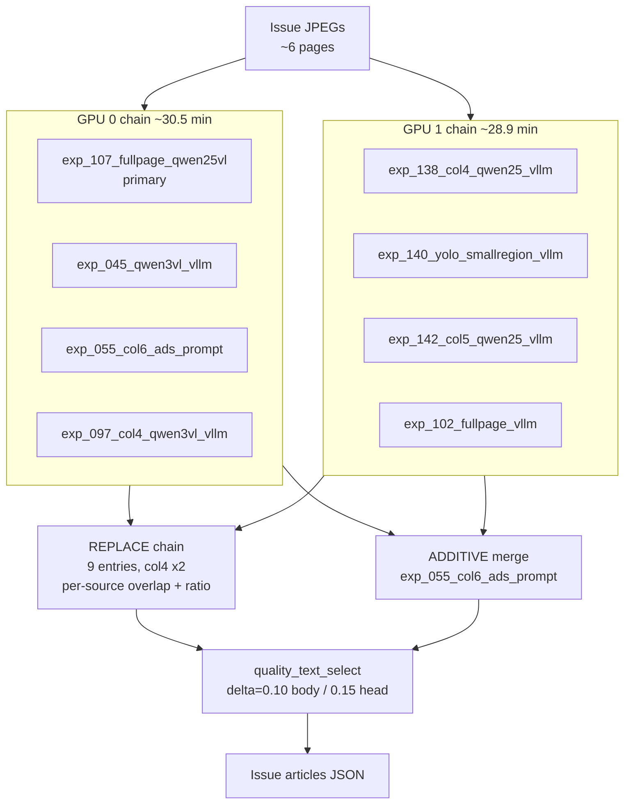
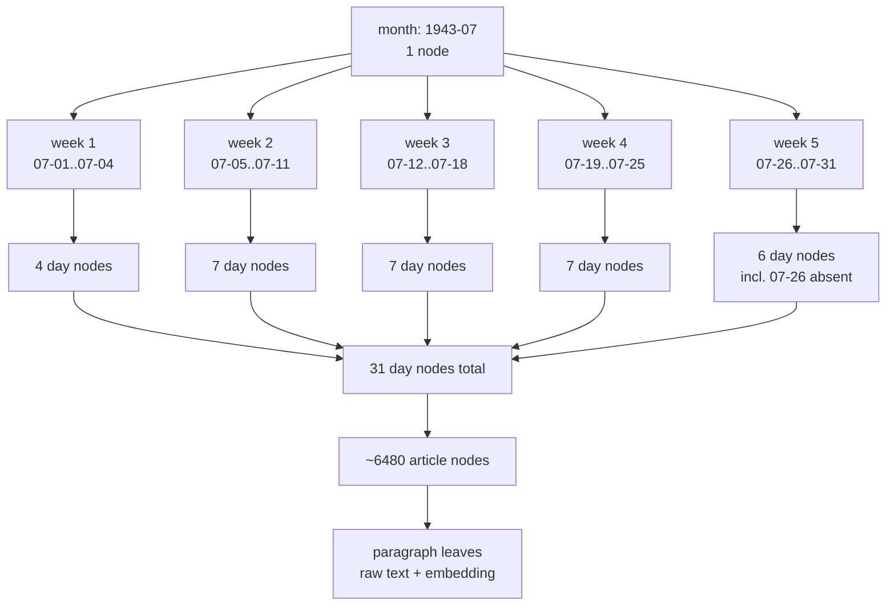
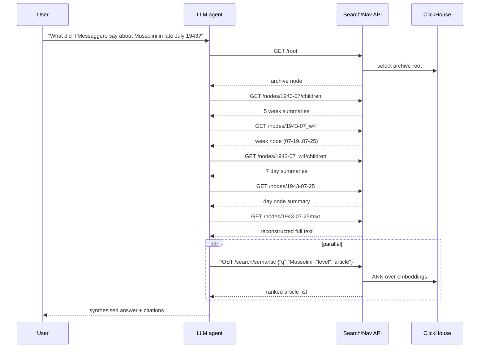

# §3 System-design diagrams

Mermaid diagrams for the Mausoleo dissertation, §3 *System design*.
One overview + one detail per sub-section (§3.1 OCR, §3.2 hierarchical index, §3.3 agent-mediated search).

## Figure 3.0 — Overview architecture

End-to-end pipeline from scanned newspaper pages to LLM-agent answers. The three modular stages (OCR, indexing, search) communicate through a single ClickHouse `nodes` table; the LLM agent only ever talks to the search/nav API.

## Figure 3.1 — OCR pipeline detail (§3.1)

Eight sub-pipelines run in two parallel GPU chains under a 30-min/issue budget. Their per-page JSON outputs flow into a deterministic ensemble: a 9-step REPLACE chain (col4 used twice), an ADDITIVE merge of the col6+ads source, and a quality-weighted text selector. Names match `eval/autoresearch/program.md`.

## Figure 3.2 — Index hierarchy for July 1943 (§3.2)

The case-study slice lifts only the first five of the seven production levels (paragraph -> article -> day -> week -> month). Counts shown are for July 1943 of *Il Messaggero*: ~6480 article nodes collapse into 31 day nodes (the 07-26 issue is absent and stored as an empty day so the chronology stays contiguous), then 5 weeks, then a single month root.

## Figure 3.3 — Agent-mediated search interaction (§3.3)

A single agent turn for a Mussolini query: the agent walks down the chronology from `root` to a specific day, pulls full text, and in parallel issues a semantic search. Tree traversal gives provenance; semantic search is the escape hatch when the chronological drill-down misses something.

